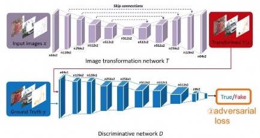
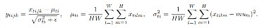
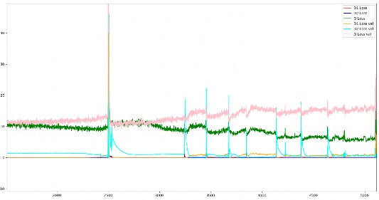

# Ooze
# Handwritten Text Generator

 INTRODUCTION 

    
 

    
The aim of
        this project is to generate the human like natural handwritten text from the text data. It tries to synthesize
        the Human Handwritings.

    
Handwritten
        synthesis is the automatic generation of data that mimic the natural handwriting. This field is a popular from
        past few years as many researches are going on this field. Handwritten Text Synthesis has different uses such as
        custom fonts generator, personalized robots, writing style detection etc. Hand Written Text synthesis make
        computers to learn by itself and generate the natural looking text in one’s writing style.

    
This field
        has lot of possibilities because the use of Deep Learning Neural Networks. It can learn different features and
        styles based on the probability distribution over the input samples. The main idea is to collect the different
        writing styles from the user and to generate the same looking handwritings. Few modern models are published in
        recent past few years which has shown significant results in this field.

    
The methodology describes the
        approaches we used in this project. We are using the Pix2Pix and CycleGAN models. Both models use the image to
        image translation to generate the probability distribution over the input samples.

    
For dataset of this project we have created our
        custom dataset of handwritten text with around 1200+ lines and 9000+ words. Different pre-processing techniques
        are applied for data cleaning and structuring. Then words are labelled with the help of a custom GUI and saved
        the compressed NumPy format.

    
For training we required a high computation
        power. We used Nvidia Quadro P4000 GPU with 32 GB RAM to train the model, for Evaluation we used techniques like
        layer adding/removing, dropout method, add weights to generators, adding validation set and changing the loss
        function. Then Results are compared with the line and words dataset for both the models. A Web App is also
        created and deployed on the internet with Flask, Heroku, HTML, CSS and JavaScript.

    
 LITERATURE
            REVIEW 

    
 

    
There are very
        less contributions are made on the handwriting synthesis by researchers. Compared to Handwritten Synthesis,
        Handwriting recognition is a general problem in the field of machine learning.

    
The work done
        is this field is mostly done by the pasting character images together to generate the sequence[1], [2].

    
This approach
        is fairly simply and not efficient as each character will look the same every time and won’t give realistic
        results

    
Our approach is based on the
        learning of the data distribution to generate the human like handwritten text.

    
 

    
 WHY DEEP
            LEARNING? 

    
 

    
Before Deep
        Learning came into focus, in classical machine learning approach there were OCR for character recognition.
        Machine Learning models only gives the results based on the input features we feed to the model to mimic pattern
        in the data. While in Deep Learning Neural Networks learns the features to generate the distribution according
        the given input. Neural Networks are capable enough to capture the little details in the data in compare to
        Machine Learning models, Therefore, Deep Learning is better choice than Machine Learning in this case.

    
 

    
 WHY
            CONVOLUTION NEURAL NETWORK? 

    
 

    
Convolution
        Neural Networks are preferred choice for working with image data in Deep Learning approach. CNNs are special
        types of Networks which consists of Convolution layer, Pooling Layer and Fully connected layer.

    
Convolution
        layer performs the convolution operation on the given image with the help of a fixed size kernel. Pooling layer
        performs the pooling operation with different approaches. Pooling is simply a method of down sampling the image.
        Fully connected layer operates on the flatten input coming from pooling layer.

    
 

    
 WORKING
            WITH SEQ2SEQ AND RECURRENT NEURAL NETWORKS 

    
 

    
Alex
        Graves[3] made a major contribution in the handwriting synthesis. Before this approach people were using
        classical machine learning algorithms to generate characters but it was not natural human like handwriting. He
        used Deep LSTM, MDM and Attention Model.

    
 A
            DIFFERENT APPROACH WITH DEEP GENERATIVE MODELS 

    
 

    
Our problem
        is to simulate and generate handwritten text and understand the flow of ligatures of a human handwriting. A
        Generative Model is a powerful way of learning any kind of data distribution using unsupervised learning and it
        has achieved tremendous success in just few years. All types of generative models aim at learning the true data
        distribution of the training set so as to generate new data points with some variations.

    
 

    

    
Figure 1 Deep
        Generative Models

    
 

    
 AUTO
            ENCODERS 

    
 

    
we can use an
        autoencoder to encode an input image to a much smaller dimensional representation which can store latent
        information about the input data distribution. But in a vanilla autoencoder, the encoded vector can only be
        mapped to the corresponding input using a decoder. It certainly can’t be used to generate similar images with
        some variability.

    
 

    

    
VARIATIONAL AUTO ENCODER

    
Kingma et al. introduced about the Variational Autoencoder in the paper[4]
        <u>Auto-Encoding Variational Bayes</u>. VAE is one of the most popular approach
            to learn the complicated data distribution such as images using neural networks in an unsupervised fashion.
            It is a probabilistic graphical model rooted in Bayesian inference i.e., the model aims to learn the
            underlying probability distribution of the training data so that it could easily sample new data from that
            learned distribution. The idea is to learn a low-dimensional latent representation of the training data
            called latent variables which we assume to have generated our actual training data. These latent variables
            can store useful information about the type of output the model needs to generate. The probability
            distribution of latent variables z is denoted by P(z). A Gaussian distribution is selected as a prior to
            learn the distribution P(z) so as to easily sample new data points during inference time. Now the primary
            objective is to model the data with some parameters which maximizes the likelihood of training data X. Under
            this generative process, our aim is to maximize the probability of each data in X which is given as,
    

    
 

    
Pө(X ) = ∫ Pө(X , z)dz = ∫ Pө(X
        |z)Pө(z)dz 

    
 GENERATIVE
            ADVERSARIAL NETWORKS 

    
 

    
In 2014 Ian
        Good Fellow introduced a paper[5] on Generative Adversarial Networks with two Neural Networks saying “A new
        framework for estimating generative models via an adversarial process, in which training of two models: a
        generative model G that captures the data distribution, and a discriminative model D that estimates the
        probability that a sample came from the training data rather than G.”

    
GAN has two
        components in its architecture, namely generator, and discriminator. GAN learns through the so-called “min-max
        two-player game.” Heuristically, its generator generates fake images that could fool the discriminator. Its
        discriminator tries to distinguish fake images from real ones. GAN loss function is as follows:

    
 

    

    
where x is
        an actual image whose distribution is subject to pdata(x). z is a random vector (or hidden state) whose
        distribution is subject to some predefined distribution pz(z). D(x) stands for the discriminator and output its
        confidence that the input is a real image. G(z) stands for generator and outputs generated images.

    
The first
        term in the GAN value function gets higher value when D(x) outputs a higher confidence rate for x. In other
        words, we are happy if D(x) is more confident in classifying real images as “real”. The second term gets higher
        if D(x) is less confident about classifying the image generated by G(z) as “real”. also, the second term gets
        lower if G(z) outputs more realistic images so that they could make D(x) more confident in classifying them as
        “real.” The “min-max two-player game” stands for the competition between generator and discriminator.

    
 

    

    
 

    
Figure 2 GANS

    
 

    
 COMARISION
        

    
 

    
In the case of the
        VAE, you train a neural network not only to generate images but to represent them compactly
        in a so-called latent space, so you train the VAE to do dimensionality reduction. More precisely, the VAE attempts to learn a probability
        distribution with smaller dimensionality than the dimensionality of the training data but that hopefully
        represents the training data. Consequently, the model is forced to learn the essential features of the
        probability distribution that generated the training data.

    
 

    
The best thing of VAE is that it
        learns both the generative model and an inference model. Although both VAE and GANs are very exciting approaches
        to learn the underlying data distribution using unsupervised learning but GANs yield better
            results as compared to VAE. In VAE, we optimize the lower variational bound whereas in GAN, there is
        no such assumption. In fact, GANs don’t deal with any explicit probability density estimation. The

    
failure of VAE in
        generating sharp images implies that the model is not able to learn the true posterior distribution.

    
VAE usually use a
        small latent dimension, the information of input is so hard to pass through this bottleneck, meanwhile it tries
        to minimize the loss with the batch of input data, you should know the result -- VAE can only
            have a mean and blurry output.

    
 

    
Handwritten generated text can
        be generated using GANs or Variational Autoencoder (VAE). But for VAE model is required
        to learn every possible ligature for sequencing which requires many deep layers and complexity of the problem
        increases. So GANs are preferred choice.

    
 

    
 TEXT TO
            IMAGE OR IMAGE TO IMAGE TRANSLATION? 

    
 

    
Text to Image
        Translation is an approach where the we feed the text input to the model and it outputs an image based on
        learned features via text. Image-to-Image translation is a class of vision and
            graphics problems where the goal is to learn the mapping between an input image and an output image.
    

    

        The problem with text to image translation is that the model will only able to learn and understand from the
        text provided, in reality there are total of 143,859 characters maintained by the
            Unicode Consortium, and as of March 2020, Every symbol and character is different and there might be a need
            to make changes in the architecture itself for few of them. So it is not an effective and general approach
            to proceed with, In Image to Image translation the model just have to learn and understand the binary pixel
            interpretation of image and we’re good to go. Hence the preferred choice is Image to Image
            Translation.

    
Image to
        Image Translation is a growing area of research due to variety of applications and we’ve listed few popular
        networks which serve this domain.

    <ol id="l1">
        <li style="padding-top: 10pt;padding-left: 10pt;text-indent: 0pt;text-align: justify;">
            
Pix2Pix

        </li>
        <li style="padding-top: 1pt;padding-left: 28pt;text-indent: -18pt;text-align: justify;">
            
Cycle-Consistent Adversarial Networks (CycleGAN)

        </li>
        <li style="padding-top: 1pt;padding-left: 28pt;text-indent: -18pt;text-align: justify;">
            
Unsupervised Image-to-Image Translation (UNIT)

        </li>
        <li style="padding-top: 1pt;padding-left: 28pt;text-indent: -18pt;text-align: justify;">
            
Multimodal Unsupervised Image-to-Image Translation (MUNIT)

        </li>
        <li style="padding-top: 1pt;padding-left: 10pt;text-indent: 0pt;line-height: 162%;text-align: left;">
            
Unsupervised Generative Attentional Networks with Adaptive Layer-Instance
                Normalization (U-GAT-IT) You Only Need Adversarial Supervision for Semantic Image Synthesis (OASIS)

        </li>
    </ol>
    
 METHODOLOGY
        

    
 

    
 OUR
            APPROACH 

    
 

    

    
PIX2PIX

    
The Pix2Pix
        Generative Adversarial Network, or GAN, is an approach to training a deep convolutional neural network for
        image-to-image translation tasks. The approach was presented by Phillip Isola, et al. in their 2016 paper[6]
        titled “Image-to-Image Translation with Conditional Adversarial Networks” and presented at CVPR in 2017.

    
 

    
The GAN architecture is
        comprised of a generator model for outputting new plausible synthetic images, and a discriminator model that
        classifies images as real (from the dataset) or fake (generated). The discriminator model is updated directly,
        whereas the generator model is updated via the discriminator model. As such, the two models are trained
        simultaneously in an adversarial process where the generator seeks to better fool the discriminator and the
        discriminator seeks to better identify the counterfeit images.

    
 

    
The Pix2Pix model is a type of
        conditional GAN, or cGAN, where the generation of the output image is conditional on an input, in this case, a
        source image. The discriminator is provided both with a source image and the target image and must determine
        whether the target is a plausible transformation of the source image.

    
 

    

    
GENERATOR

    
The generator
        is trained via adversarial loss, which encourages the generator to generate plausible images in the target
        domain. The generator is also updated via L1 loss measured between the generated image and the expected output
        image. This additional loss encourages the generator model to create plausible translations of the source image.
    

    
In Pix2Pix,
        the generator is a convolutional network with U-net architecture. It takes in the input image passes it through
        a series of convolution and up-sampling layers. Finally, it produces an output image that is of the same size as
        the input.

    
 

    

    
Figure 3 U-Net

    
 

    
The Skip Connections in the
        U-Net differentiate it from a standard Encoder-decoder architecture. The Generator takes in the Image to be
        translated and compresses it into a low-dimensional, “Bottleneck”, vector representation. The Generator then
        learns how to up-sample this into the output image. The U-Net is similar

    
to ResNets in
        the way that information from earlier layers are integrated into later layers. The U-Net skip connections are
        also interesting because they do not require any resizing, projections etc. since the spatial resolution of the
        layers being connected already match each other. The encoder and decoder of the generator are comprised of
        standardized blocks of convolutional, <u>batch normalization</u>, <u>dropout</u>, and activation layers.

    
 

    

    
DISCRIMINATOR

    
The
        discriminator is a deep convolutional neural network that performs image classification. Specifically,
        conditional-image classification. The discriminator design is based on the effective receptive field of the
        model, which defines the relationship between one output of the model to the number of pixels in the input
        image. This is called a PatchGAN model and is carefully designed so that each output prediction of the model
        maps to a 70×70 square or patch of the input image. The benefit of this approach is that the same model can be
        applied to input images of different sizes, e.g. larger or smaller than 256×256 pixels.

    
The output
        of the model depends on the size of the input image but may be one value or a square activation map of values.
        Each value is a probability for the likelihood that a patch in the input image is real. These values can be
        averaged to give an overall likelihood or classification score if needed.

    
 

    

    
Figure 4 PatchGAN
    

    
 

    

    
DUAL OBJECTIVE
        FUNCTION WITH ADVERSARIAL AND L1 LOSS

    
The Conditional-Adversarial
        Loss (Generator versus Discriminator) is very popularly formatted as follows:

    
 

    

    
The L1 loss function
        previously mentioned is shown below:

    
 

    

    
Combining these functions
        results in:

    
 

    

    

    
 

    

    
 

    
Figure 5 Pix2Pix
        Architecture

    
 

    

    
PROBLEM WITH
        PIX2PIX:

    <ol id="l2">
        <li style="padding-top: 12pt;padding-left: 28pt;text-indent: -18pt;text-align: justify;">
            
Requires paired images to perform translation.

        </li>
        <li style="padding-top: 1pt;padding-left: 28pt;text-indent: -18pt;line-height: 115%;text-align: left;">
            
On a given paired image dataset, one model can only be trained to perform
                translation from one domain to another domain and not vice versa.

        </li>
        <li style="padding-left: 28pt;text-indent: -18pt;line-height: 114%;text-align: left;">
            
Since pix2pix’s generator is using the U-Net architecture which implies that the
                input images can only be in dimension of (NxN).

        </li>
    </ol>
    
In our case
        the general dimension of any text between 2 guidelines is (MxN). Even each word brings its own inconsistencies
        of size, since the number of characters in a word can commonly range from 3 to 12, hence the dimension of the
        image will vary accordingly and therefore the input image cannot be of dimension (NxN).

    
There are
        few tricks that could be done for example cropping the image, resizing the image and leaving the rest of the
        area with white space or squishing the words to resize it in form of (NxN), yet it will be very difficult to
        recover input’s original dimension.

    

    
CYCLEGAN

    
The CycleGAN
        model was described by Jun-Yan Zhu, et al. in their 2017 paper[7] titled “Unpaired Image-to- Image Translation
        using Cycle-Consistent Adversarial Networks” .

    
The benefit
        of the CycleGAN model is that it can be trained without paired examples. Recent methods such as Pix2Pix depend
        on the availability of training examples where the same data is available in both domains. The power of CycleGAN
        lies in being able to learn such transformations without one-to-one mapping between training data in source and
        target domains, i.e. it does not require examples of photographs before and after the translation in order to
        train the model. Instead, the model is able to use a collection of photographs from each domain and extract and
        harness the underlying style of images in the collection in order to perform the translation. The need for a
        paired image in the target domain is eliminated by making a two-step transformation of source domain image -
        first by trying to map it to target domain and then back to the original image. Mapping the image to target
        domain is done using a generator network and the quality of this generated image is improved by pitching the
        generator against a discriminator.

    
 

    

    
Figure 6 Paired
        unpaired Images

    
 

    

    
COMPONENTS

    
The CycleGAN
        proposes four models instead of the usual two. The first generator, which we’ll call Generator A, is for
        generating images for the first domain (Domain A) and the second generator (Generator B) is for generating
        images for the second domain (Domain B).

    
Generator A
        -&gt; Domain A Generator B -&gt; Domain B

    
Since the generator models
        perform image translation, they’ll accept an image of the other domain as input. Meaning, Generator A will take
        an image from Domain B as input to translate it to Domain A and similarly, Generator B takes an image from
        Domain A as input.

    
We can summarize this as
        follows:

    
 

    
Domain B -&gt;
        Generator A -&gt; Domain A Domain A -&gt; Generator B -&gt; Domain B

    
Now, each generator has a
        corresponding discriminator model. The first discriminator model (Discriminator

    
A) takes real
        images from Domain A and generated images from Generator A and predicts whether they are real or fake. The
        second discriminator model (Discriminator B) takes real images from Domain B and generated images from Generator
        B and predicts whether they are real or fake.

    
That is,

    
 

    
Domain A -&gt; Discriminator A
        -&gt; [Real/Fake]

    
Domain B -&gt;
        Generator A -&gt; Discriminator A -&gt; [Real/Fake] Domain B -&gt; Discriminator B -&gt; [Real/Fake]

    
Domain A -&gt; Generator B -&gt;
        Discriminator B -&gt; [Real/Fake]

    
The
        discriminator and generator models are trained in an adversarial zero-sum process, like normal GAN models. The
        generators learn to better fool the discriminators and the discriminator learns to better detect fake images.
        Together, the models find equilibrium during the training process.

    
 

    

    
NETWORK ARCHITECTURE

    
 

    

    
 

    
Figure 7 CycleGAN (a)
    

    
 

    

    
 

    
Figure 8 CycleGAN (b)

    

    
GENERATOR

    
The CycleGAN
        generator is the same in that it also an encoder-decoder model architecture that takes a source image and
        generates a target image by down-sampling or encoding the input image down to a bottleneck layer. But it is
        different than the pix2pix generator in that the encodings are interpreted with a number of ResNet (Residual)
        layers that use skip connections, followed by a series of layers that up-sample or decode the representation to
        the size of the output image which again, follows the pix2pix generator scheme.

    
Below is a schematic
        representation of the CycleGAN generator:

    
 

    

    
 

    
 

    
The generator have three
        components:

    
Figure 9 CycleGAN
        generator

    
 

    <ul id="l3">
        <li style="padding-left: 28pt;text-indent: -18pt;line-height: 20pt;text-align: left;">
            
Encoder - The input image is passed into the encoder. The encoder extracts
                features from the input image

            
by
                using Convolutions and compressed the representation of image but increase the number of channels. The
                encoder consists of 3 convolution that reduces the representation by 1/4th of actual image size.
                Consider an image of size (256, 256, 3) which we input into the encoder, the output of encoder will be
                (64, 64, 256).

        </li>
        <li style="padding-left: 28pt;text-indent: -18pt;line-height: 15pt;text-align: left;">
            
Transformer - The output of encoder after activation function is applied is
                passed into the transformer.

            
The
                transformer contains 9 residual blocks based on the size of input.

        </li>
        <li style="padding-top: 2pt;padding-left: 28pt;text-indent: -18pt;line-height: 17pt;text-align: left;">
            
Decoder - The output of transformer is then passed into the decoder which uses 2
                -deconvolution block of fraction strides to increase the size of representation to original size.

        </li>
    </ul>
    

    
DISCRIMINATOR

    
The
        discriminator is a Convolutional Neural Network that performs image classification. The discriminator design of
        the CycleGAN is based on the effective receptive field of the model, which defines the relationship between one
        output of the model to the number of pixels in the input image. This is called a Patch GAN model and is
        carefully designed so that each output prediction of the model maps to a 70×70 square or patch of the input
        image. The benefit of this approach is that the same model can be applied to input images of different sizes,
        e.g. larger or smaller than 256×256 pixels.

    
The output
        of the model depends on the size of the input image but maybe one value or a square activation map of values.
        Each value is a probability for the likelihood that a patch in the input image is real. These values can be
        averaged to give an overall likelihood or classification score if needed.

    
The CycleGAN
        discriminator uses Instance Normalization instead of Batch Normalization. It is a very simple type of
        normalization and involves standardizing like scaling to a standard Gaussian, the values on each output feature
        map, rather than across features in a batch which is done by Batch Normalization.

    
 

    

    
Figure 10
        Normalizations

    
 

    

    
 

    

    
 

    
Figure 11 CycleGAN Discriminator

    

    
LOSS FUNCTION

    
The
        discriminator models are directly trained on images whereas the generator models are updated to minimize the
        loss predicted by the discriminator for generated images marked as “real“, called adversarial
            loss. As such, they are encouraged to generate images that better fit into the target domain.

    
 

    

    
 

    
The generator models are also
        updated based on how effective they are at the regeneration of a source image when used with the other generator
        model, called cycle loss.

    
 

    

    
The generator model is expected
        to output an image without translation when provided an example from the target domain, called identity loss.

    
 

    

    
 

    
Altogether, each generator model is optimized
        via the combination of four outputs with four-loss functions:

    <ol id="l4">
        <li style="padding-top: 12pt;padding-left: 28pt;text-indent: -18pt;text-align: justify;">
            
Adversarial loss (L2 or mean squared error).

        </li>
        <li style="padding-top: 2pt;padding-left: 28pt;text-indent: -18pt;text-align: justify;">
            
Identity loss (L1 or mean absolute error).

        </li>
        <li style="padding-top: 2pt;padding-left: 28pt;text-indent: -18pt;text-align: justify;">
            
Forward cycle loss (L1 or mean absolute error).

        </li>
        <li style="padding-top: 2pt;padding-left: 28pt;text-indent: -18pt;text-align: justify;">
            
Backward cycle loss (L1 or mean absolute error).

        </li>
    </ol>
    
The
        discriminator is connected to the output of the generator in order to classify generated images as real or fake.
        A second input for the composite model is defined as an image from the target domain (instead of the source
        domain), which the generator is expected to output without translation for the identity mapping. Next, forward
        cycle loss involves connecting the output of the generator to the other generator, which will reconstruct the
        source image. Finally, the backward cycle loss involves the image from the target domain used for the identity
        mapping that is also passed through the other generator whose output is connected to our main generator as input
        and outputs a reconstructed version of that image from the target domain.

    

        GENERATOR A COMPOSITE MODEL

    

    
The inputs, transformations, and
        outputs of the model are as follows:

    
 

    <table style="border-collapse:collapse;margin-left:6.52pt" cellspacing="0">
        <tr style="height:41pt">
            <td
                style="width:85pt;border-top-style:solid;border-top-width:1pt;border-top-color:#EDEDED;border-left-style:solid;border-left-width:1pt;border-left-color:#EDEDED;border-bottom-style:solid;border-bottom-width:1pt;border-bottom-color:#EDEDED;border-right-style:solid;border-right-width:1pt;border-right-color:#EDEDED">
                
Loss

            </td>
            <td
                style="width:64pt;border-top-style:solid;border-top-width:1pt;border-top-color:#EDEDED;border-left-style:solid;border-left-width:1pt;border-left-color:#EDEDED;border-bottom-style:solid;border-bottom-width:1pt;border-bottom-color:#EDEDED;border-right-style:solid;border-right-width:1pt;border-right-color:#EDEDED">
                
From

            </td>
            <td
                style="width:71pt;border-top-style:solid;border-top-width:1pt;border-top-color:#EDEDED;border-left-style:solid;border-left-width:1pt;border-left-color:#EDEDED;border-bottom-style:solid;border-bottom-width:1pt;border-bottom-color:#EDEDED;border-right-style:solid;border-right-width:1pt;border-right-color:#EDEDED">
                
Via

            </td>
            <td
                style="width:58pt;border-top-style:solid;border-top-width:1pt;border-top-color:#EDEDED;border-left-style:solid;border-left-width:1pt;border-left-color:#EDEDED;border-bottom-style:solid;border-bottom-width:1pt;border-bottom-color:#EDEDED;border-right-style:solid;border-right-width:1pt;border-right-color:#EDEDED">
                
To

            </td>
            <td
                style="width:62pt;border-top-style:solid;border-top-width:1pt;border-top-color:#EDEDED;border-left-style:solid;border-left-width:1pt;border-left-color:#EDEDED;border-bottom-style:solid;border-bottom-width:1pt;border-bottom-color:#EDEDED;border-right-style:solid;border-right-width:1pt;border-right-color:#EDEDED">
                
Via

            </td>
            <td
                style="width:50pt;border-top-style:solid;border-top-width:1pt;border-top-color:#EDEDED;border-left-style:solid;border-left-width:1pt;border-left-color:#EDEDED;border-bottom-style:solid;border-bottom-width:1pt;border-bottom-color:#EDEDED;border-right-style:solid;border-right-width:1pt;border-right-color:#EDEDED">
                
To

            </td>
            <td
                style="width:142pt;border-top-style:solid;border-top-width:1pt;border-top-color:#EDEDED;border-left-style:solid;border-left-width:1pt;border-left-color:#EDEDED;border-bottom-style:solid;border-bottom-width:1pt;border-bottom-color:#EDEDED;border-right-style:solid;border-right-width:1pt;border-right-color:#EDEDED">
                
Loss
                    Calculated Between

            </td>
        </tr>
        <tr style="height:52pt">
            <td
                style="width:85pt;border-top-style:solid;border-top-width:1pt;border-top-color:#EDEDED;border-left-style:solid;border-left-width:1pt;border-left-color:#EDEDED;border-bottom-style:solid;border-bottom-width:1pt;border-bottom-color:#EDEDED;border-right-style:solid;border-right-width:1pt;border-right-color:#EDEDED">
                
 

                
Adversarial Loss

            </td>
            <td
                style="width:64pt;border-top-style:solid;border-top-width:1pt;border-top-color:#EDEDED;border-left-style:solid;border-left-width:1pt;border-left-color:#EDEDED;border-bottom-style:solid;border-bottom-width:1pt;border-bottom-color:#EDEDED;border-right-style:solid;border-right-width:1pt;border-right-color:#EDEDED">
                
 

                
Domain B

            </td>
            <td
                style="width:71pt;border-top-style:solid;border-top-width:1pt;border-top-color:#EDEDED;border-left-style:solid;border-left-width:1pt;border-left-color:#EDEDED;border-bottom-style:solid;border-bottom-width:1pt;border-bottom-color:#EDEDED;border-right-style:solid;border-right-width:1pt;border-right-color:#EDEDED">
                
 

                
Generator A

            </td>
            <td
                style="width:58pt;border-top-style:solid;border-top-width:1pt;border-top-color:#EDEDED;border-left-style:solid;border-left-width:1pt;border-left-color:#EDEDED;border-bottom-style:solid;border-bottom-width:1pt;border-bottom-color:#EDEDED;border-right-style:solid;border-right-width:1pt;border-right-color:#EDEDED">
                
 

                
Domain A

            </td>
            <td
                style="width:62pt;border-top-style:solid;border-top-width:1pt;border-top-color:#EDEDED;border-left-style:solid;border-left-width:1pt;border-left-color:#EDEDED;border-bottom-style:solid;border-bottom-width:1pt;border-bottom-color:#EDEDED;border-right-style:solid;border-right-width:1pt;border-right-color:#EDEDED">
                
 

                
–

            </td>
            <td
                style="width:50pt;border-top-style:solid;border-top-width:1pt;border-top-color:#EDEDED;border-left-style:solid;border-left-width:1pt;border-left-color:#EDEDED;border-bottom-style:solid;border-bottom-width:1pt;border-bottom-color:#EDEDED;border-right-style:solid;border-right-width:1pt;border-right-color:#EDEDED">
                
 

                
–

            </td>
            <td
                style="width:142pt;border-top-style:solid;border-top-width:1pt;border-top-color:#EDEDED;border-left-style:solid;border-left-width:1pt;border-left-color:#EDEDED;border-bottom-style:solid;border-bottom-width:1pt;border-bottom-color:#EDEDED;border-right-style:solid;border-right-width:1pt;border-right-color:#EDEDED">
                
 

                
Generated
                    Domain A Image &amp; Discriminator for Domain A

            </td>
        </tr>
        <tr style="height:52pt">
            <td
                style="width:85pt;border-top-style:solid;border-top-width:1pt;border-top-color:#EDEDED;border-left-style:solid;border-left-width:1pt;border-left-color:#EDEDED;border-bottom-style:solid;border-bottom-width:1pt;border-bottom-color:#EDEDED;border-right-style:solid;border-right-width:1pt;border-right-color:#EDEDED">
                
 

                
Identity Loss

            </td>
            <td
                style="width:64pt;border-top-style:solid;border-top-width:1pt;border-top-color:#EDEDED;border-left-style:solid;border-left-width:1pt;border-left-color:#EDEDED;border-bottom-style:solid;border-bottom-width:1pt;border-bottom-color:#EDEDED;border-right-style:solid;border-right-width:1pt;border-right-color:#EDEDED">
                
 

                
Domain A

            </td>
            <td
                style="width:71pt;border-top-style:solid;border-top-width:1pt;border-top-color:#EDEDED;border-left-style:solid;border-left-width:1pt;border-left-color:#EDEDED;border-bottom-style:solid;border-bottom-width:1pt;border-bottom-color:#EDEDED;border-right-style:solid;border-right-width:1pt;border-right-color:#EDEDED">
                
 

                
Generator A

            </td>
            <td
                style="width:58pt;border-top-style:solid;border-top-width:1pt;border-top-color:#EDEDED;border-left-style:solid;border-left-width:1pt;border-left-color:#EDEDED;border-bottom-style:solid;border-bottom-width:1pt;border-bottom-color:#EDEDED;border-right-style:solid;border-right-width:1pt;border-right-color:#EDEDED">
                
 

                
Domain A

            </td>
            <td
                style="width:62pt;border-top-style:solid;border-top-width:1pt;border-top-color:#EDEDED;border-left-style:solid;border-left-width:1pt;border-left-color:#EDEDED;border-bottom-style:solid;border-bottom-width:1pt;border-bottom-color:#EDEDED;border-right-style:solid;border-right-width:1pt;border-right-color:#EDEDED">
                
 

                
–

            </td>
            <td
                style="width:50pt;border-top-style:solid;border-top-width:1pt;border-top-color:#EDEDED;border-left-style:solid;border-left-width:1pt;border-left-color:#EDEDED;border-bottom-style:solid;border-bottom-width:1pt;border-bottom-color:#EDEDED;border-right-style:solid;border-right-width:1pt;border-right-color:#EDEDED">
                
 

                
–

            </td>
            <td
                style="width:142pt;border-top-style:solid;border-top-width:1pt;border-top-color:#EDEDED;border-left-style:solid;border-left-width:1pt;border-left-color:#EDEDED;border-bottom-style:solid;border-bottom-width:1pt;border-bottom-color:#EDEDED;border-right-style:solid;border-right-width:1pt;border-right-color:#EDEDED">
                
 

                
Original
                    Domain A Image &amp; Generated Domain A Image

            </td>
        </tr>
        <tr style="height:52pt">
            <td
                style="width:85pt;border-top-style:solid;border-top-width:1pt;border-top-color:#EDEDED;border-left-style:solid;border-left-width:1pt;border-left-color:#EDEDED;border-bottom-style:solid;border-bottom-width:1pt;border-bottom-color:#EDEDED;border-right-style:solid;border-right-width:1pt;border-right-color:#EDEDED">
                
 

                

                    Forward Cycle Loss

            </td>
            <td
                style="width:64pt;border-top-style:solid;border-top-width:1pt;border-top-color:#EDEDED;border-left-style:solid;border-left-width:1pt;border-left-color:#EDEDED;border-bottom-style:solid;border-bottom-width:1pt;border-bottom-color:#EDEDED;border-right-style:solid;border-right-width:1pt;border-right-color:#EDEDED">
                
 

                
Domain B

            </td>
            <td
                style="width:71pt;border-top-style:solid;border-top-width:1pt;border-top-color:#EDEDED;border-left-style:solid;border-left-width:1pt;border-left-color:#EDEDED;border-bottom-style:solid;border-bottom-width:1pt;border-bottom-color:#EDEDED;border-right-style:solid;border-right-width:1pt;border-right-color:#EDEDED">
                
 

                
Generator A

            </td>
            <td
                style="width:58pt;border-top-style:solid;border-top-width:1pt;border-top-color:#EDEDED;border-left-style:solid;border-left-width:1pt;border-left-color:#EDEDED;border-bottom-style:solid;border-bottom-width:1pt;border-bottom-color:#EDEDED;border-right-style:solid;border-right-width:1pt;border-right-color:#EDEDED">
                
 

                
Domain A

            </td>
            <td
                style="width:62pt;border-top-style:solid;border-top-width:1pt;border-top-color:#EDEDED;border-left-style:solid;border-left-width:1pt;border-left-color:#EDEDED;border-bottom-style:solid;border-bottom-width:1pt;border-bottom-color:#EDEDED;border-right-style:solid;border-right-width:1pt;border-right-color:#EDEDED">
                
 

                
Generator B

            </td>
            <td
                style="width:50pt;border-top-style:solid;border-top-width:1pt;border-top-color:#EDEDED;border-left-style:solid;border-left-width:1pt;border-left-color:#EDEDED;border-bottom-style:solid;border-bottom-width:1pt;border-bottom-color:#EDEDED;border-right-style:solid;border-right-width:1pt;border-right-color:#EDEDED">
                
 

                

                    Domain B

            </td>
            <td
                style="width:142pt;border-top-style:solid;border-top-width:1pt;border-top-color:#EDEDED;border-left-style:solid;border-left-width:1pt;border-left-color:#EDEDED;border-bottom-style:solid;border-bottom-width:1pt;border-bottom-color:#EDEDED;border-right-style:solid;border-right-width:1pt;border-right-color:#EDEDED">
                
 

                
Original
                    Domain B Image and Reconstructed Domain B Image

            </td>
        </tr>
        <tr style="height:52pt">
            <td
                style="width:85pt;border-top-style:solid;border-top-width:1pt;border-top-color:#EDEDED;border-left-style:solid;border-left-width:1pt;border-left-color:#EDEDED;border-bottom-style:solid;border-bottom-width:1pt;border-bottom-color:#EDEDED;border-right-style:solid;border-right-width:1pt;border-right-color:#EDEDED">
                
 

                

                    Backward Cycle Loss

            </td>
            <td
                style="width:64pt;border-top-style:solid;border-top-width:1pt;border-top-color:#EDEDED;border-left-style:solid;border-left-width:1pt;border-left-color:#EDEDED;border-bottom-style:solid;border-bottom-width:1pt;border-bottom-color:#EDEDED;border-right-style:solid;border-right-width:1pt;border-right-color:#EDEDED">
                
 

                
Domain A

            </td>
            <td
                style="width:71pt;border-top-style:solid;border-top-width:1pt;border-top-color:#EDEDED;border-left-style:solid;border-left-width:1pt;border-left-color:#EDEDED;border-bottom-style:solid;border-bottom-width:1pt;border-bottom-color:#EDEDED;border-right-style:solid;border-right-width:1pt;border-right-color:#EDEDED">
                
 

                
Generator B

            </td>
            <td
                style="width:58pt;border-top-style:solid;border-top-width:1pt;border-top-color:#EDEDED;border-left-style:solid;border-left-width:1pt;border-left-color:#EDEDED;border-bottom-style:solid;border-bottom-width:1pt;border-bottom-color:#EDEDED;border-right-style:solid;border-right-width:1pt;border-right-color:#EDEDED">
                
 

                
Domain B

            </td>
            <td
                style="width:62pt;border-top-style:solid;border-top-width:1pt;border-top-color:#EDEDED;border-left-style:solid;border-left-width:1pt;border-left-color:#EDEDED;border-bottom-style:solid;border-bottom-width:1pt;border-bottom-color:#EDEDED;border-right-style:solid;border-right-width:1pt;border-right-color:#EDEDED">
                
 

                
Generator B

            </td>
            <td
                style="width:50pt;border-top-style:solid;border-top-width:1pt;border-top-color:#EDEDED;border-left-style:solid;border-left-width:1pt;border-left-color:#EDEDED;border-bottom-style:solid;border-bottom-width:1pt;border-bottom-color:#EDEDED;border-right-style:solid;border-right-width:1pt;border-right-color:#EDEDED">
                
 

                

                    Domain A

            </td>
            <td
                style="width:142pt;border-top-style:solid;border-top-width:1pt;border-top-color:#EDEDED;border-left-style:solid;border-left-width:1pt;border-left-color:#EDEDED;border-bottom-style:solid;border-bottom-width:1pt;border-bottom-color:#EDEDED;border-right-style:solid;border-right-width:1pt;border-right-color:#EDEDED">
                
 

                
Original
                    Domain A Image and Reconstructed Domain A Image

            </td>
        </tr>
    </table>
    
 

    

        GENERATOR B COMPOSITE MODEL

    

    
The inputs, transformations, and
        outputs of the model are as follows:

    
 

    <table style="border-collapse:collapse;margin-left:6.52pt" cellspacing="0">
        <tr style="height:41pt">
            <td
                style="width:95pt;border-top-style:solid;border-top-width:1pt;border-top-color:#EDEDED;border-left-style:solid;border-left-width:1pt;border-left-color:#EDEDED;border-bottom-style:solid;border-bottom-width:1pt;border-bottom-color:#EDEDED;border-right-style:solid;border-right-width:1pt;border-right-color:#EDEDED">
                
Loss

            </td>
            <td
                style="width:49pt;border-top-style:solid;border-top-width:1pt;border-top-color:#EDEDED;border-left-style:solid;border-left-width:1pt;border-left-color:#EDEDED;border-bottom-style:solid;border-bottom-width:1pt;border-bottom-color:#EDEDED;border-right-style:solid;border-right-width:1pt;border-right-color:#EDEDED">
                
From

            </td>
            <td
                style="width:58pt;border-top-style:solid;border-top-width:1pt;border-top-color:#EDEDED;border-left-style:solid;border-left-width:1pt;border-left-color:#EDEDED;border-bottom-style:solid;border-bottom-width:1pt;border-bottom-color:#EDEDED;border-right-style:solid;border-right-width:1pt;border-right-color:#EDEDED">
                
Via

            </td>
            <td
                style="width:48pt;border-top-style:solid;border-top-width:1pt;border-top-color:#EDEDED;border-left-style:solid;border-left-width:1pt;border-left-color:#EDEDED;border-bottom-style:solid;border-bottom-width:1pt;border-bottom-color:#EDEDED;border-right-style:solid;border-right-width:1pt;border-right-color:#EDEDED">
                
To

            </td>
            <td
                style="width:58pt;border-top-style:solid;border-top-width:1pt;border-top-color:#EDEDED;border-left-style:solid;border-left-width:1pt;border-left-color:#EDEDED;border-bottom-style:solid;border-bottom-width:1pt;border-bottom-color:#EDEDED;border-right-style:solid;border-right-width:1pt;border-right-color:#EDEDED">
                
Via

            </td>
            <td
                style="width:48pt;border-top-style:solid;border-top-width:1pt;border-top-color:#EDEDED;border-left-style:solid;border-left-width:1pt;border-left-color:#EDEDED;border-bottom-style:solid;border-bottom-width:1pt;border-bottom-color:#EDEDED;border-right-style:solid;border-right-width:1pt;border-right-color:#EDEDED">
                
To

            </td>
            <td
                style="width:180pt;border-top-style:solid;border-top-width:1pt;border-top-color:#EDEDED;border-left-style:solid;border-left-width:1pt;border-left-color:#EDEDED;border-bottom-style:solid;border-bottom-width:1pt;border-bottom-color:#EDEDED;border-right-style:solid;border-right-width:1pt;border-right-color:#EDEDED">
                
Loss
                    Calculated Between

            </td>
        </tr>
        <tr style="height:52pt">
            <td
                style="width:95pt;border-top-style:solid;border-top-width:1pt;border-top-color:#EDEDED;border-left-style:solid;border-left-width:1pt;border-left-color:#EDEDED;border-bottom-style:solid;border-bottom-width:1pt;border-bottom-color:#EDEDED;border-right-style:solid;border-right-width:1pt;border-right-color:#EDEDED">
                
 

                
Adversarial Loss

            </td>
            <td
                style="width:49pt;border-top-style:solid;border-top-width:1pt;border-top-color:#EDEDED;border-left-style:solid;border-left-width:1pt;border-left-color:#EDEDED;border-bottom-style:solid;border-bottom-width:1pt;border-bottom-color:#EDEDED;border-right-style:solid;border-right-width:1pt;border-right-color:#EDEDED">
                
 

                

                    Domain A

            </td>
            <td
                style="width:58pt;border-top-style:solid;border-top-width:1pt;border-top-color:#EDEDED;border-left-style:solid;border-left-width:1pt;border-left-color:#EDEDED;border-bottom-style:solid;border-bottom-width:1pt;border-bottom-color:#EDEDED;border-right-style:solid;border-right-width:1pt;border-right-color:#EDEDED">
                
 

                

                    Generator B

            </td>
            <td
                style="width:48pt;border-top-style:solid;border-top-width:1pt;border-top-color:#EDEDED;border-left-style:solid;border-left-width:1pt;border-left-color:#EDEDED;border-bottom-style:solid;border-bottom-width:1pt;border-bottom-color:#EDEDED;border-right-style:solid;border-right-width:1pt;border-right-color:#EDEDED">
                
 

                

                    Domain B

            </td>
            <td
                style="width:58pt;border-top-style:solid;border-top-width:1pt;border-top-color:#EDEDED;border-left-style:solid;border-left-width:1pt;border-left-color:#EDEDED;border-bottom-style:solid;border-bottom-width:1pt;border-bottom-color:#EDEDED;border-right-style:solid;border-right-width:1pt;border-right-color:#EDEDED">
                
 

                
–

            </td>
            <td
                style="width:48pt;border-top-style:solid;border-top-width:1pt;border-top-color:#EDEDED;border-left-style:solid;border-left-width:1pt;border-left-color:#EDEDED;border-bottom-style:solid;border-bottom-width:1pt;border-bottom-color:#EDEDED;border-right-style:solid;border-right-width:1pt;border-right-color:#EDEDED">
                
 

                
–

            </td>
            <td
                style="width:180pt;border-top-style:solid;border-top-width:1pt;border-top-color:#EDEDED;border-left-style:solid;border-left-width:1pt;border-left-color:#EDEDED;border-bottom-style:solid;border-bottom-width:1pt;border-bottom-color:#EDEDED;border-right-style:solid;border-right-width:1pt;border-right-color:#EDEDED">
                
 

                
Generated
                    Domain B Image &amp; Discriminator for Domain B

            </td>
        </tr>
        <tr style="height:52pt">
            <td
                style="width:95pt;border-top-style:solid;border-top-width:1pt;border-top-color:#EDEDED;border-left-style:solid;border-left-width:1pt;border-left-color:#EDEDED;border-bottom-style:solid;border-bottom-width:1pt;border-bottom-color:#EDEDED;border-right-style:solid;border-right-width:1pt;border-right-color:#EDEDED">
                
 

                
Identity Loss

            </td>
            <td
                style="width:49pt;border-top-style:solid;border-top-width:1pt;border-top-color:#EDEDED;border-left-style:solid;border-left-width:1pt;border-left-color:#EDEDED;border-bottom-style:solid;border-bottom-width:1pt;border-bottom-color:#EDEDED;border-right-style:solid;border-right-width:1pt;border-right-color:#EDEDED">
                
 

                

                    Domain B

            </td>
            <td
                style="width:58pt;border-top-style:solid;border-top-width:1pt;border-top-color:#EDEDED;border-left-style:solid;border-left-width:1pt;border-left-color:#EDEDED;border-bottom-style:solid;border-bottom-width:1pt;border-bottom-color:#EDEDED;border-right-style:solid;border-right-width:1pt;border-right-color:#EDEDED">
                
 

                

                    Generator B

            </td>
            <td
                style="width:48pt;border-top-style:solid;border-top-width:1pt;border-top-color:#EDEDED;border-left-style:solid;border-left-width:1pt;border-left-color:#EDEDED;border-bottom-style:solid;border-bottom-width:1pt;border-bottom-color:#EDEDED;border-right-style:solid;border-right-width:1pt;border-right-color:#EDEDED">
                
 

                

                    Domain B

            </td>
            <td
                style="width:58pt;border-top-style:solid;border-top-width:1pt;border-top-color:#EDEDED;border-left-style:solid;border-left-width:1pt;border-left-color:#EDEDED;border-bottom-style:solid;border-bottom-width:1pt;border-bottom-color:#EDEDED;border-right-style:solid;border-right-width:1pt;border-right-color:#EDEDED">
                
 

                
–

            </td>
            <td
                style="width:48pt;border-top-style:solid;border-top-width:1pt;border-top-color:#EDEDED;border-left-style:solid;border-left-width:1pt;border-left-color:#EDEDED;border-bottom-style:solid;border-bottom-width:1pt;border-bottom-color:#EDEDED;border-right-style:solid;border-right-width:1pt;border-right-color:#EDEDED">
                
 

                
–

            </td>
            <td
                style="width:180pt;border-top-style:solid;border-top-width:1pt;border-top-color:#EDEDED;border-left-style:solid;border-left-width:1pt;border-left-color:#EDEDED;border-bottom-style:solid;border-bottom-width:1pt;border-bottom-color:#EDEDED;border-right-style:solid;border-right-width:1pt;border-right-color:#EDEDED">
                
 

                
Original
                    Domain B Image &amp; Generated Domain B Image

            </td>
        </tr>
        <tr style="height:52pt">
            <td
                style="width:95pt;border-top-style:solid;border-top-width:1pt;border-top-color:#EDEDED;border-left-style:solid;border-left-width:1pt;border-left-color:#EDEDED;border-bottom-style:solid;border-bottom-width:1pt;border-bottom-color:#EDEDED;border-right-style:solid;border-right-width:1pt;border-right-color:#EDEDED">
                
 

                
Forward Cycle Loss

            </td>
            <td
                style="width:49pt;border-top-style:solid;border-top-width:1pt;border-top-color:#EDEDED;border-left-style:solid;border-left-width:1pt;border-left-color:#EDEDED;border-bottom-style:solid;border-bottom-width:1pt;border-bottom-color:#EDEDED;border-right-style:solid;border-right-width:1pt;border-right-color:#EDEDED">
                
 

                

                    Domain A

            </td>
            <td
                style="width:58pt;border-top-style:solid;border-top-width:1pt;border-top-color:#EDEDED;border-left-style:solid;border-left-width:1pt;border-left-color:#EDEDED;border-bottom-style:solid;border-bottom-width:1pt;border-bottom-color:#EDEDED;border-right-style:solid;border-right-width:1pt;border-right-color:#EDEDED">
                
 

                

                    Generator B

            </td>
            <td
                style="width:48pt;border-top-style:solid;border-top-width:1pt;border-top-color:#EDEDED;border-left-style:solid;border-left-width:1pt;border-left-color:#EDEDED;border-bottom-style:solid;border-bottom-width:1pt;border-bottom-color:#EDEDED;border-right-style:solid;border-right-width:1pt;border-right-color:#EDEDED">
                
 

                

                    Domain B

            </td>
            <td
                style="width:58pt;border-top-style:solid;border-top-width:1pt;border-top-color:#EDEDED;border-left-style:solid;border-left-width:1pt;border-left-color:#EDEDED;border-bottom-style:solid;border-bottom-width:1pt;border-bottom-color:#EDEDED;border-right-style:solid;border-right-width:1pt;border-right-color:#EDEDED">
                
 

                

                    Generator A

            </td>
            <td
                style="width:48pt;border-top-style:solid;border-top-width:1pt;border-top-color:#EDEDED;border-left-style:solid;border-left-width:1pt;border-left-color:#EDEDED;border-bottom-style:solid;border-bottom-width:1pt;border-bottom-color:#EDEDED;border-right-style:solid;border-right-width:1pt;border-right-color:#EDEDED">
                
 

                

                    Domain A

            </td>
            <td
                style="width:180pt;border-top-style:solid;border-top-width:1pt;border-top-color:#EDEDED;border-left-style:solid;border-left-width:1pt;border-left-color:#EDEDED;border-bottom-style:solid;border-bottom-width:1pt;border-bottom-color:#EDEDED;border-right-style:solid;border-right-width:1pt;border-right-color:#EDEDED">
                
 

                
Original
                    Domain A Image and Reconstructed Domain A Image

            </td>
        </tr>
        <tr style="height:52pt">
            <td
                style="width:95pt;border-top-style:solid;border-top-width:1pt;border-top-color:#EDEDED;border-left-style:solid;border-left-width:1pt;border-left-color:#EDEDED;border-bottom-style:solid;border-bottom-width:1pt;border-bottom-color:#EDEDED;border-right-style:solid;border-right-width:1pt;border-right-color:#EDEDED">
                
 

                
Backward Cycle Loss

            </td>
            <td
                style="width:49pt;border-top-style:solid;border-top-width:1pt;border-top-color:#EDEDED;border-left-style:solid;border-left-width:1pt;border-left-color:#EDEDED;border-bottom-style:solid;border-bottom-width:1pt;border-bottom-color:#EDEDED;border-right-style:solid;border-right-width:1pt;border-right-color:#EDEDED">
                
 

                

                    Domain B

            </td>
            <td
                style="width:58pt;border-top-style:solid;border-top-width:1pt;border-top-color:#EDEDED;border-left-style:solid;border-left-width:1pt;border-left-color:#EDEDED;border-bottom-style:solid;border-bottom-width:1pt;border-bottom-color:#EDEDED;border-right-style:solid;border-right-width:1pt;border-right-color:#EDEDED">
                
 

                

                    Generator A

            </td>
            <td
                style="width:48pt;border-top-style:solid;border-top-width:1pt;border-top-color:#EDEDED;border-left-style:solid;border-left-width:1pt;border-left-color:#EDEDED;border-bottom-style:solid;border-bottom-width:1pt;border-bottom-color:#EDEDED;border-right-style:solid;border-right-width:1pt;border-right-color:#EDEDED">
                
 

                

                    Domain A

            </td>
            <td
                style="width:58pt;border-top-style:solid;border-top-width:1pt;border-top-color:#EDEDED;border-left-style:solid;border-left-width:1pt;border-left-color:#EDEDED;border-bottom-style:solid;border-bottom-width:1pt;border-bottom-color:#EDEDED;border-right-style:solid;border-right-width:1pt;border-right-color:#EDEDED">
                
 

                

                    Generator B

            </td>
            <td
                style="width:48pt;border-top-style:solid;border-top-width:1pt;border-top-color:#EDEDED;border-left-style:solid;border-left-width:1pt;border-left-color:#EDEDED;border-bottom-style:solid;border-bottom-width:1pt;border-bottom-color:#EDEDED;border-right-style:solid;border-right-width:1pt;border-right-color:#EDEDED">
                
 

                

                    Domain B

            </td>
            <td
                style="width:180pt;border-top-style:solid;border-top-width:1pt;border-top-color:#EDEDED;border-left-style:solid;border-left-width:1pt;border-left-color:#EDEDED;border-bottom-style:solid;border-bottom-width:1pt;border-bottom-color:#EDEDED;border-right-style:solid;border-right-width:1pt;border-right-color:#EDEDED">
                
 

                
Original
                    Domain B Image and Reconstructed Domain B Image

            </td>
        </tr>
    </table>
    
 DATASET
        

    
 

    
A Custom
        Handwritten Dataset is used in this project. Dataset is consists of texts from the books named “The Biography of
        Swami Vivekananda” and “The Secret” . Which has different type of writing styles.

    

    

    
This dataset
        contains 1200+ lines and around 9000+ words. Each Page contains average 23 lines on a page with size of A4.

    
 

    
Figure 12 DATASET
    

    
 

    
 DATASET
            PRE-PROCESSING 

    
 

    

    
LINE DETECTION

    
The given
        image has no guidelines; the text is written on the simple paper, In that case, we can simply find the
        orientation of the text and segment each line with Horizontal histogram technique by profile projection in a
        particular orientation. Once the coloured image is converted to the binary image only black and white pixels are
        present in the image.

    
In a binary
        image, pixels which represent the useful information are called Foreground pixels, whereas the pixels which are
        not foreground pixels are called Background pixels. It is our choice whether a foreground pixel should be a
        white pixel or black pixel while binarizing the image.

    
Horizontal
        Histogram Projection: In this method, we count the number of foreground pixels along the rows of the image and
        the resultant array is of the size equal to number of rows in the image (Height of the image).

    
We are
        splitting page into N Lines by Horizontal Histogram Technique, if ratio of black pixel/ total pixel cross the
        threshold of 0.97 then we can declare it as line and applying the rectify() to remove noisy pixel which might
        hinder the threshold.

    
The output blocks
        of contours of white and black colour representing text and blank side respectively, Later we extract lines by
        finding these contours and splitting pages into lines.

    

    
Horizontal Histogram

    <ul id="l5">
        <li style="padding-top: 12pt;padding-left: 23pt;text-indent: -18pt;text-align: justify;">
            
isLine()

        </li>
        <li style="padding-top: 1pt;padding-left: 23pt;text-indent: -18pt;text-align: justify;">
            
Rectify()

        </li>
        <li style="padding-top: 1pt;padding-left: 23pt;text-indent: -18pt;text-align: justify;">
            
Inverse Binary

        </li>
        <li style="padding-top: 1pt;padding-left: 23pt;text-indent: -18pt;text-align: justify;">
            
Find Contours

        </li>
        <li style="padding-left: 23pt;text-indent: -18pt;text-align: justify;">
            
Draw Bounding Box

        </li>
        <li style="padding-top: 1pt;padding-left: 23pt;text-indent: -18pt;text-align: justify;">
            
Crop Image into contours captured

        </li>
    </ul>
    
 

    
Figure 13 Horizontal
        Histogram

    
 

    

    
 

    
Figure 14 Line
        Detection

    
 

    

    
 

    
Figure 15 Segmented
        Line

    

    
WORD SEGMENTATION

    
 

    
Using
        vertical histogram words are separated from background part. This vertical histogram method checks for a given
        column whether it crosses the threshold (background pixels &gt; foreground pixels). if yes then we&#39;ll colour
        the column black (assuming we have white as a background colour) But there are some thin ligatures which can
        cross the threshold so to remove that errorious decision we use rectify function which checks connectivity of
        pixel with some left and some right pixels.

    
In a binary
        image, pixels which represent the useful information are called Foreground pixels, whereas the pixels which are
        not foreground pixels are called Background pixels. In this method, we count the number of foreground pixels
        along the columns of the image and the resultant array is of the size equal to number of columns in the image
        (Width of the image).

    
We are
        splitting Lines into n Words by Horizontal Histogram Technique, if ratio of (number of black pixels) / (number
        of total pixels) cross the threshold of 0.945 then we can declare it as word and applying the rectify() to
        remove noisy pixel which might hinder the threshold.

    
The output
        blocks of contours of black and white colour representing text and black side respectively, Later we extract
        words by finding these contours and splitting lines into words.

    
 

    

    
Figure 16 Vertical
        Histogram

    
 

    

    
 

    
Figure 17 Words from Line

    
 

    
NOTE: - In the above image
        foreground pixels are in white and background pixels are in black. In the above image,

    <ul id="l6">
        <li style="padding-left: 28pt;text-indent: -18pt;line-height: 15pt;text-align: justify;">
            
Higher peaks imply number of foreground pixels in the corresponding column are
                high.

        </li>
        <li style="padding-left: 28pt;text-indent: -18pt;text-align: justify;">
            
Higher peaks imply number of foreground pixels in the corresponding column are
                low.

        </li>
    </ul>
    
 

    

    
] 

    
Figure 18
        Segmented Words

    

    
RESIZING AND
        NORMALIZING

    
The pixel
        values in images must be scaled prior to providing the images as input to a deep learning neural network model
        during the training or evaluation of the model. We rescale the pixel values from the range of 0-255 to the range
        0-1 preferred for neural network models. Scaling data to the range of 0-1 is traditionally referred to as
        normalization. This can be achieved by setting the rescale argument to a ratio by which each pixel can be
        multiplied to achieve the desired range.

    
To pass any
        image to a convolution layer we must resize it, this can be done by libraries like OpenCV, Sklearn, Pillow, etc.
        we can simply down sample the images to a fixed height and width which might result in squishing or stretching
        the image.

    
There is
        another way, we can add padding (white space) around the images to make each image of same height and width,
        this does not hinder with the image texture or looks.

    
 

    

    
NUMPY COMPRESSED ARRAY (.NPZ)

    
To save the
        large object we can compress the numpy arrays. After Resizing Convert into the Numpy Compressed Array for Faster
        Calculation. The .npz file format is a zipped archive of files named after the variables they contain. The
        savez_compressed() function is used to save several arrays into a single file in compressed .npz format.

    
 

    

    
LABELLING WORDS

    
 

    

    
 

    
Figure 19 GUI for
        Labelling Words

    
 

    
This GUI is made using the
        Tkinter library to label the words. It Loads the words and text from lines in which the word is there. Based on
        the text associated with lines in which arrives GUI gives the Recommendation for labelling the words images.
        Enter Label Text Area gives the flexibility of Typing the correct word if it is not shown in the recommendation
        section. The final labels are pickled in a dictionary where the key is image’s name and value is the actual
        word.

    
 TRAINING
        

    
 

    

    

    
The training
        approach was fairly typical for an image-to-image translation task. we load our paired images dataset in
        compressed NumPy array format. This will return a list of two NumPy arrays: the first for source images and the
        second for corresponding target images. The Adam optimizer, a common variant of gradient descent, was used to
        make training more stable and efficient. The learning rate was set to 0.0002 for the first half of training, and
        then linearly reduced to zero over the remaining iterations. The batch size was set to 1, which is why we refer
        to instance normalization, rather than batch normalization. To monitor and visualize the loss in real time,
        after each iteration we append the loss to a csv file, so we can read and visualize the recent loss any time.
        This is model summary, on the left we have generator and on the right we have discriminator and GAN composite
        model. As we know by now that CycleGAN has 2 generator 2 discriminator and hence 2 GAN composite models.
        Architecture of both the model remains the same and have the same number of parameters.

    
 

    

    

        This is model summary, on the left we have generator and on the right we have discriminator and GAN composite
        model. As we know by now that CycleGAN has 2 generator 2 discriminator and hence 2 GAN composite models.
        Architecture of both the model remains the same and have the same number of parameters.

    
 

    
TRAINABLE PARAMETERS

    
 

    <table style="border-collapse:collapse;margin-left:207.6pt" cellspacing="0">
        <tr style="height:17pt">
            <td style="width:155pt;border-top-style:solid;border-top-width:1pt;border-top-color:#7F7F7F;border-right-style:solid;border-right-width:1pt;border-right-color:#7F7F7F"
                bgcolor="#F2F2F2">
                
GENERATOR A2B

            </td>
            <td style="width:193pt;border-top-style:solid;border-top-width:1pt;border-top-color:#7F7F7F;border-left-style:solid;border-left-width:1pt;border-left-color:#7F7F7F"
                bgcolor="#F2F2F2">
                
35,264,003

            </td>
        </tr>
        <tr style="height:19pt">
            <td style="width:155pt;border-right-style:solid;border-right-width:1pt;border-right-color:#7F7F7F">
                
GENERATOR B2A

            </td>
            <td style="width:193pt;border-left-style:solid;border-left-width:1pt;border-left-color:#7F7F7F">
                
35,264,003

            </td>
        </tr>
        <tr style="height:18pt">
            <td style="width:155pt;border-right-style:solid;border-right-width:1pt;border-right-color:#7F7F7F"
                bgcolor="#F2F2F2">
                
DISCRIMINATOR A2B

            </td>
            <td style="width:193pt;border-left-style:solid;border-left-width:1pt;border-left-color:#7F7F7F"
                bgcolor="#F2F2F2">
                
6,960,321

            </td>
        </tr>
        <tr style="height:19pt">
            <td style="width:155pt;border-right-style:solid;border-right-width:1pt;border-right-color:#7F7F7F">
                
DISCRIMINATOR B2A

            </td>
            <td style="width:193pt;border-left-style:solid;border-left-width:1pt;border-left-color:#7F7F7F">
                
6,960,321

            </td>
        </tr>
        <tr style="height:19pt">
            <td style="width:155pt;border-right-style:solid;border-right-width:1pt;border-right-color:#7F7F7F"
                bgcolor="#F2F2F2">
                
COMPOSITE MODEL A2B

            </td>
            <td style="width:193pt;border-left-style:solid;border-left-width:1pt;border-left-color:#7F7F7F"
                bgcolor="#F2F2F2">
                
35,264,003

            </td>
        </tr>
        <tr style="height:19pt">
            <td style="width:155pt;border-right-style:solid;border-right-width:1pt;border-right-color:#7F7F7F">
                
COMPOSITE MODEL B2A

            </td>
            <td style="width:193pt;border-left-style:solid;border-left-width:1pt;border-left-color:#7F7F7F">
                
35,264,003

            </td>
        </tr>
    </table>
    

    
    

    
EVALUATION &amp;
        OPTIMIZATION

    
Overfitting was
        one of the major issues during the training of Model because our Dataset contains only 9000+ images which is not
        sufficient comparatively.

    
There are other problems in
        Generative Models such as,

    

        Non-Convergence: Here the parameters of model oscillate and become unstable and never converge. Model Collapse:
        The generator produces the limited variations because of this problem.

    
Diminished gradient: When
        generator gradient vanishes and learns nothing than discriminator becomes very successful.

    
Following methods are used for
        Evaluation.

    

        Change in architecture: Adding/Reduction in layers

    

        Add Dropout: 30% - 50%

    

        Add Loss weights: More weights to Generators

    

        Add Validation dataset: To monitor variance and bias

    

        Change Loss function: Wasserstein Loss

    

    

    
PIX2PIX LOSS LOGS

    
 

    

    
Figure 20 pix2pix model is getting
        overfit with line dataset

    
 

    

    
Figure 21 Pix2pix model with less
        layers in architecture

    
 

    
Figure 22 Pix2pix model with batch
        size of 10 getting overfit

    

    
 

    
Figure 23 Overfitting
        of Pix2pix model on word dataset

    
 

    
Pix2Pix model
        has certain limitations, because of its U-Net architecture we can only feel square images to the generator which
        makes it difficult to resize since words are of variable length and lines have rectangular dimension i.e. have
        more width than height, it hinders the training since the generated feature map won’t be able to grasp all the
        details and features.

    
Overfitting
        is another cause with we observed with Pix2Pix, the validation loss overshoot after 7-10 epochs even after
        applying regularization and changing the architecture of the network, this could be because of lack of data, but
        there may be other reasons too.

    
Either way the
        pix2pix architecture isn’t suited for this problem although the problem was paired image to image translation,
        still CycleGAN performs much better because of its ingenious cycle consistency loss, the problem of mode
        collapse and overshooting the validation loss won’t occur. Yet it is very hard to train and understand when to
        stop training, one can only visualize the results while training to see the progress and know when to stop.

    

    

    
CYCLEGAN LOSS LOGS

    
 

    
Figure 24 CycleGAN model with line
        dataset

    
 

    

    
 

    
Figure 25 CycleGAN
        model with word dataset

    
 

    
As we can see, initially
        CycleGAN is optimizing it’s network fast and trying hard to compete with the discriminator, yet the gradients
        slowly become small as the changes are now really minute as more iterations passes by, we can see the
        fluctuations in the generator loss, that’s because of the instance normalization we are taking the batch size of
        1 and now we are updating weights for every iteration rather than for every epoch, this may sometime lead to
        false gradient and wrong direction hence the fluctuations. CycleGAN performed much better than pix2Pix in this
        case and it didn’t face any mode collapse issue which is very common while training any GAN model. Lack of data
        was still an issue with line dataset as there were only 1200+ images, Increasing the size of dataset will surely
        give state of the art result.

    
 DEPLOYMENT
        

    
 

    

    
Figure 26
        Deployment

    
 

    
Front End is designed with HTML ,
        Design is created using the CSS and Animated using JavaScript. It also contains the Bootstrap support for more
        robust design of frontend.

    
Backend is made using the
        microframework Flask which is used to create web apps using Python Language.

    
 

    
When user gives input text, the
        input text is first converted to Image. This converted image is then feed to the trained model and from this
        input sample model generate the image which again sent to the user back.

    
 

    

    
Figure 27 User
        Interface of webapp

    
 RESULTS
            WITH CYCLE GAN 

    
 

    
 RESULTS
            WITH LINES DATASET 

    
 

    

    
Figure 28 Results
        with Line dataset

    
 

    
 RESULTS WITH WORD DATASET 

    
 

    

    
 

    

    
Figure 29 Results
        with word dataset

    
 CONCLUSION
        

    
 

    
As stated
        before we used the Generative model approach for this project. It had few challenging problems during the
        training. The first problem was of amount of the dataset we could manage. We created dataset of around 1200+
        lines and size of words in that dataset was around 9000+. However, for a Deep Learning Neural Network the amount
        of Data is not sufficient to train. This problem can be neglected using the large amount of data.

    
Image to
        Image translations is a good approach for handwritten text imitation/generation as the model doesn’t have to
        have any knowledge about symbols or characters and it can easily decipher from pixels and this model can be used
        for any language as the input format is always going to be an image.

    
 

    
 FUTURE WORK
        

    
 

    
We can train
        our model on line dataset as it has fixed rectangular shape instead of words which has variable lengths. This is
        result in better performance as the model will be able to grasp more features. There are other architectures of
        generative models which came out this years and showed really promising results in the domain of image to image
        translation such as UNIT, MUNIT, U-GAT-IT and OASIS, we can use these networks to train and generate images for
        better result.

    
 REFERENCES
        

    
 

    <ol id="l7">
        <li style="padding-top: 5pt;padding-left: 42pt;text-indent: -32pt;line-height: 112%;text-align: left;">
            
“1j01/scribble: DEPRECATED - Draws scribbly looking
                    things. &quot;$#%&amp;&#39;()*.”
                    https://github.com/1j01/scribble (accessed Dec. 29, 2020).

        </li>
        <li style="padding-top: 10pt;padding-left: 42pt;text-indent: -32pt;line-height: 115%;text-align: left;">
            
“Belval/TextRecognitionDataGenerator: A synthetic data generator for
                text recognition.” https://github.com/Belval/TextRecognitionDataGenerator (accessed Dec. 29, 2020).

        </li>
        <li style="padding-top: 9pt;padding-left: 42pt;text-indent: -32pt;line-height: 115%;text-align: left;">
            
<a href="http://arxiv.org/abs/1308.0850" class="a" target="_blank">A. Graves,
                    “Generating Sequences With Recurrent Neural Networks,” Aug. 2013, Accessed: Dec. 29, 2020. [Online].
                    Available: </a><a href="http://arxiv.org/abs/1308.0850"
                    target="_blank">http://arxiv.org/abs/1308.0850.</a>

        </li>
        <li style="padding-top: 9pt;padding-left: 39pt;text-indent: -29pt;text-align: left;">
            
D. P. Kingma and M. Welling, “Auto-Encoding Variational Bayes.”
                Accessed: Dec. 29, 2020. [Online].

            
 

        </li>
        <li style="padding-left: 42pt;text-indent: -32pt;line-height: 113%;text-align: left;">
            
I. J. Goodfellow <i>et al.</i><a
                    href="http://www.github.com/goodfeli/adversarial" class="a" target="_blank">, “Generative
                    Adversarial Nets.” Accessed: Dec. 29, 2020. [Online]. Available: </a><a
                    href="http://www.github.com/goodfeli/adversarial"
                    target="_blank">http://www.github.com/goodfeli/adversarial.</a>

        </li>
        <li style="padding-top: 10pt;padding-left: 42pt;text-indent: -32pt;line-height: 114%;text-align: left;">
            
P. Isola, J.-Y. Zhu, T. Zhou, and A. A. Efros, “Image-to-Image
                Translation with Conditional Adversarial Networks,” <i>Proceedings - 30th IEEE Conference on Computer
                    Vision and Pattern Recognition, CVPR 2017</i><a href="http://arxiv.org/abs/1611.07004" class="a"
                    target="_blank">, vol. 2017-January, pp. 5967–5976, Nov. 2016, Accessed: Dec. 29, 2020. [Online].
                    Available: </a><a href="http://arxiv.org/abs/1611.07004"
                    target="_blank">http://arxiv.org/abs/1611.07004.</a>

        </li>
        <li style="padding-top: 10pt;padding-left: 42pt;text-indent: -32pt;line-height: 114%;text-align: left;">
            
J.-Y. Zhu, T. Park, P. Isola, and A. A. Efros, “Unpaired
                Image-to-Image Translation using Cycle-Consistent Adversarial Networks,” <i>Proceedings of the IEEE
                    International Conference on Computer Vision</i><a href="http://arxiv.org/abs/1703.10593" class="a"
                    target="_blank">, vol. 2017-October, pp. 2242–2251, Mar. 2017, Accessed: Dec. 29, 2020. [Online].
                    Available: </a><a href="http://arxiv.org/abs/1703.10593"
                    target="_blank">http://arxiv.org/abs/1703.10593.</a>

        </li>
        <li style="padding-top: 9pt;padding-left: 42pt;text-indent: -32pt;line-height: 113%;text-align: left;">
            
X. Huang, L. Wen, and J. DIng, “SAR and Optical Image Registration
                Method Based on Improved CycleGAN,” <i>2019 6th Asia-Pacific Conference on Synthetic Aperture Radar,
                    APSAR 2019</i>, 2019, doi: 10.1109/APSAR46974.2019.9048448.

        </li>
        <li style="padding-top: 10pt;padding-left: 42pt;text-indent: -32pt;line-height: 115%;text-align: left;">
            
L. Kang, M. Rusiñol, A. Fornés, P. Riba, and M. Villegas,
                “Unsupervised adaptation for synthetic-to-real handwritten word recognition,” <i>arXiv</i>, pp.
                3491–3500, 2019.

        </li>
        <li style="padding-top: 9pt;padding-left: 42pt;text-indent: -32pt;line-height: 114%;text-align: left;">
            
S. Park and J. C. Ye, “Unsupervised Cone-Beam Artifact Removal Using
                CycleGAN and Spectral Blending for Adaptive Radiotherapy,” <i>Proceedings - International Symposium on
                    Biomedical Imaging</i>, vol. 2020-April, pp. 638–641, 2020, doi: 10.1109/ISBI45749.2020.9098367.

        </li>
        <li style="padding-top: 9pt;padding-left: 42pt;text-indent: -32pt;line-height: 114%;text-align: left;">
            
G. Senthil, K. Nandhakumar, and G. R. K. S. Subrahmanyam,
                “Handwritten Hindi Word Generation to enable Few Instance Learning of Hindi Documents,” <i>SPCOM 2020 -
                    International Conference on Signal Processing and Communications</i>, 2020, doi:
                10.1109/SPCOM50965.2020.9179634.

        </li>
        <li style="padding-top: 9pt;padding-left: 42pt;text-indent: -32pt;line-height: 115%;text-align: left;">
            
T. L. Sung and H. J. Lee, “Image-to-image translation using
                Identical-pair Adversarial Networks,” <i>Applied Sciences (Switzerland)</i>, vol. 9, no. 13, pp. 1–15,
                2019, doi: 10.3390/app9132668.

        </li>
        <li style="padding-top: 9pt;padding-left: 42pt;text-indent: -32pt;line-height: 114%;text-align: left;">
            
E. Alonso, B. Moysset, and R. Messina, “Adversarial generation of
                handwritten text images conditioned on sequences,” <i>Proceedings of the International Conference on
                    Document Analysis and Recognition, ICDAR</i>, pp. 481–486, 2019, doi: 10.1109/ICDAR.2019.00083.

        </li>
    </ol>